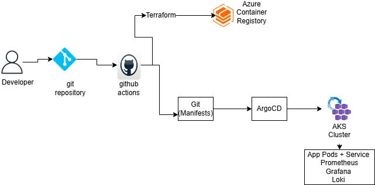
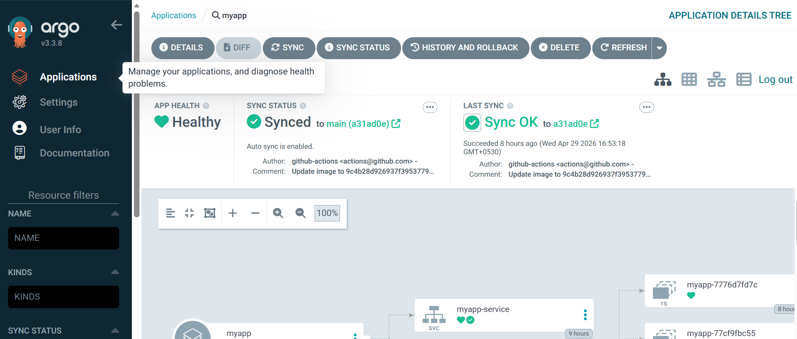
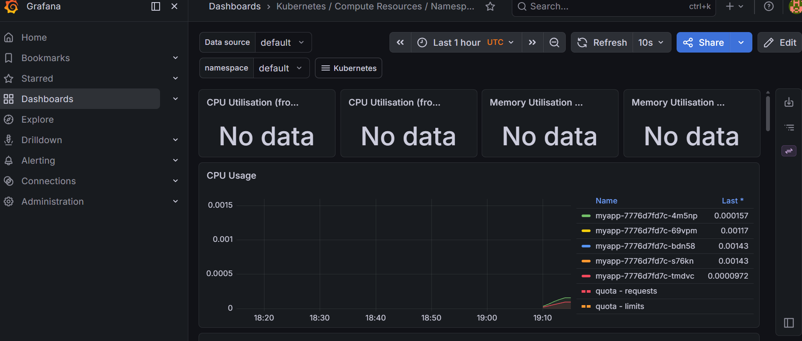

# 🚀 Azure Cloud-Native Platform (End-to-End DevOps + GitOps)

## 📌 Overview

This project demonstrates a production-grade cloud-native platform built using Azure, Kubernetes, and modern DevOps practices.

It covers the complete lifecycle:

* Infrastructure provisioning
* CI/CD automation
* GitOps deployment
* Observability (metrics + logs)

---

## 🧠 Architecture



---

## ⚙️ Tech Stack

* **Cloud**: Azure (AKS, ACR, VNet)
* **Infrastructure as Code**: Terraform
* **Containerization**: Docker
* **Orchestration**: Kubernetes (AKS)
* **CI/CD**: GitHub Actions
* **GitOps**: ArgoCD
* **Monitoring**: Prometheus + Grafana
* **Logging**: Loki + Promtail

---

## 🚀 Key Features

* End-to-end automated deployment pipeline
* GitOps-based Kubernetes deployment
* Modular Terraform infrastructure
* Real-time monitoring dashboards
* Centralized logging system
* Secure cloud-native architecture

---

## 🔄 Deployment Flow

1. Developer pushes code to GitHub
2. GitHub Actions builds Docker image
3. Image pushed to Azure Container Registry
4. Kubernetes manifest updated in Git
5. ArgoCD detects changes and syncs with AKS
6. Application deployed automatically

---

## 🧱 Project Structure

```
app/                # Application code
terraform/          # Infrastructure provisioning
k8s-manifests/      # Kubernetes deployment configs
.github/workflows/  # CI/CD pipeline
docs/               # Architecture & documentation
```

---

## 📊 Observability

### Metrics (Prometheus + Grafana)

* CPU / Memory usage
* Pod health monitoring
* Cluster-level insights

### Logs (Loki)

* Centralized log aggregation
* Query logs using Grafana Explore

---

## 🧠 Key Learnings

* GitOps vs traditional CI/CD
* Kubernetes deployment strategies
* Infrastructure modularization
* Observability best practices
* Debugging real-world cloud issues

---

## ⚠️ Challenges & Fixes

* ArgoCD CRD size issue → used core install
* GitHub Actions permission error → enabled `contents: write`
* Docker build path issue → fixed build context
* Namespace issue → added explicit namespace
* Loki connectivity issue → corrected service URL

---

## 🔮 Future Improvements

* Ingress Controller with TLS
* Horizontal Pod Autoscaling (HPA)
* Alerting with Alertmanager
* Service Mesh (Istio)
* Multi-environment setup (Dev/Prod separation)

---

## 📌 Conclusion

This project simulates a real-world platform engineering setup, combining infrastructure, CI/CD, GitOps, and observability into a unified system.
## 📸 Screenshots


